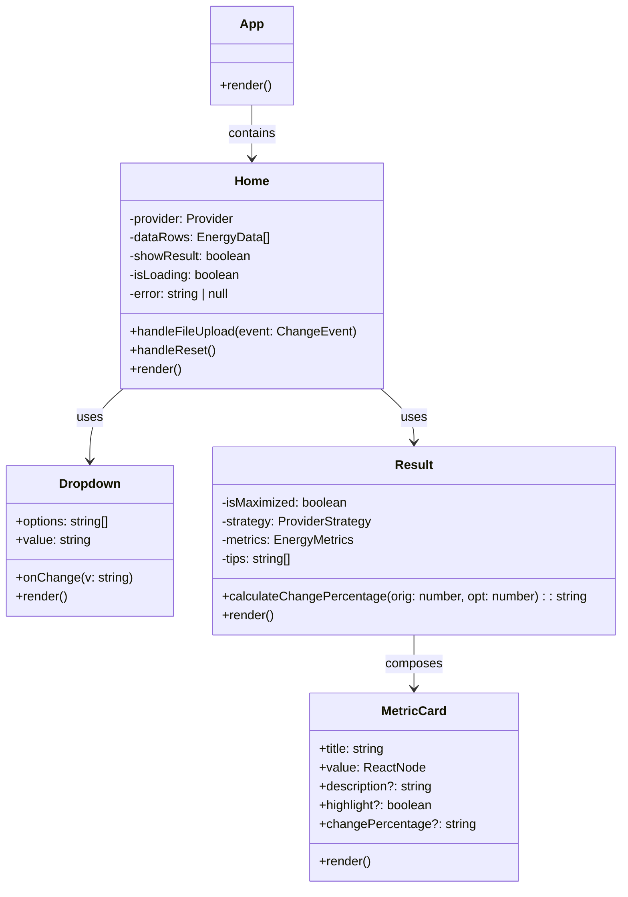

# Grid Collective Simulator

An interactive web application that simulates and optimizes household energy consumption under different Swedish grid providers' pricing models, specifically focused on **power-based tariffs** (effektavgift). Developed as a bachelor's thesis project for LMTX38 at Chalmers University of Technology, in collaboration with Grid Collective AB.

## The Problem

Swedish grid operators like Ellevio and Göteborgs Energi have shifted from kWh-based billing to **power-based tariffs**, where customers are charged based on their top 3 peak consumption hours per month rather than total kWh. This means a few hours of heavy usage can dramatically increase your monthly bill, even if total consumption stays the same.

This project explores how much money households could save by intelligently **redistributing** their energy consumption, shifting peaks to low-demand periods without changing total energy use.

## What It Does

The application takes a CSV export of hourly electricity consumption (the kind you can download from any grid provider's "Mina Sidor"), and:

1. **Parses** timestamped usage data
2. **Applies** the correct pricing model for the selected grid provider
3. **Runs optimization algorithms** that simulate load shifting
4. **Visualizes** before vs after with interactive charts
5. **Calculates** exact savings in SEK with percentage breakdowns
6. **Generates** actionable tips for reducing peak consumption

## Architecture

Two-layer design: a **React/TypeScript web app** for the end-user experience, and a **plain JavaScript algorithm playground** (the `algo/` directory) used during thesis research for comparing algorithm variants side by side.

### Web Application (`simulator/`)

A single-page React app built with Vite, Tailwind CSS, and Recharts.

**Core components:**

- **Strategy pattern** -- Each grid provider is modeled as a `ProviderStrategy` interface with `calculateMetrics()`, `applyRule()`, and `getTips()` methods. Adding a new provider means implementing one class.
- **EllevioStrategy** -- Accounts for night hours (22:00-06:00) where consumption counts at 50% for billing. Optimizes by shifting 50% of top-3 peak consumption to the lowest-demand night slots.
- **GoteborgsStrategy** -- No night discount. Same top-N peak redistribution but across all hours.
- **Result visualization** -- Dual-line chart with area fills showing before/after consumption, Sun/Moon icons marking peak hours, reference lines for average top-3, and expandable fullscreen mode.

**Tech stack:**

| Layer | Technology |
|-------|-----------|
| Framework | React 19, TypeScript |
| Build | Vite 6 |
| Styling | Tailwind CSS 4 |
| Charts | Recharts 2 |
| CSV parsing | PapaParse 5 |
| Icons | Lucide React |
| Linting | ESLint + typescript-eslint |

### Algorithm Playground (`algo/`)

A standalone HTML + JavaScript page used during research to compare **8 different optimization strategies** across **2 provider models** (16 total configurations):

| Strategy | Description |
|----------|-------------|
| **Top-3 Reduction** | Identify the 3 highest peak hours, shift 50% of each to low-demand slots |
| **Top-5 Reduction** | Same as above but for the top 5 peaks |
| **Top-7 Reduction** | Same as above but for the top 7 peaks |
| **Peak Shaving** | Sliding window detection -- if a value exceeds local average by a threshold, shave the excess and distribute to neighbors |
| **Valley Filling** | Iteratively transfer energy from global peaks to the lowest-demand hours (capacity-limited) |
| **Daily Redistribution** | Group by date, redistribute each day toward its average while respecting capacity caps |
| **Consumption Smoothing** | Moving average filter with proportional nudging, with total consumption preservation |
| **Linear Flattening** | Weight-based redistribution favoring night hours (2x weight) |

For Ellevio, the night-hour rule (50% discount during 22:00-06:00) is applied to the output of each algorithm before calculating the resulting fee. For Goteborgs Energi, no such adjustment is made.

## Key Results

The simulator demonstrates that simple load-shifting heuristics can achieve **significant reductions** in power-based fees without battery storage or behavioral changes -- purely by scheduling:

- **Top-N optimization** consistently outperforms other heuristics for both providers
- Night-hour weighting gives Ellevio customers an additional structural advantage
- Peak shaving and valley filling provide moderate savings but are more sensitive to data patterns
- The algorithm playground page allows side-by-side comparison of all strategies on the same dataset

## Getting Started

```bash
cd simulator
npm install
npm run dev
```

To run the built version:

```bash
npm run build
npm run preview
```

### Input Format

The app expects a semicolon-delimited CSV with two columns:

```
Date;Usage
2024-01-01 00:00;3.42
2024-01-01 01:00;2.81
2024-01-01 02:00;1.95
```

Lines starting with `#` are ignored (comments). Decimal commas are automatically converted to periods.

This format matches the standard export from most Swedish grid providers' customer portals.

## Project Structure

```
lmtx38_gridsim/
├── algo/
│   ├── algo.html              -- Algorithm comparison playground
│   └── algo.js                -- 8 optimization strategies for 2 providers
├── simulator/
│   ├── src/
│   │   ├── App.tsx            -- Root component
│   │   ├── pages/
│   │   │   ├── Home.tsx       -- CSV upload, provider selection, results
│   │   │   └── Result.tsx     -- Metrics display, charts, tips
│   │   ├── components/
│   │   │   └── Dropdown.tsx   -- Provider selection dropdown
│   │   └── calculations/
│   │       ├── core.ts        -- Strategy interface, data types, registry
│   │       ├── ellevio.ts     -- Ellevio pricing model + night rule
│   │       └── ge.ts          -- Goteborgs Energi pricing model
│   ├── package.json
│   └── vite.config.ts
└── README.md
```

## Component Architecture



## License

This project was developed as a bachelor's thesis project at Chalmers University of Technology, in collaboration with Grid Collective AB.
